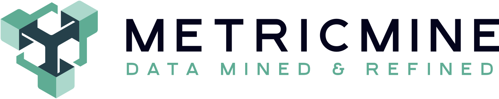
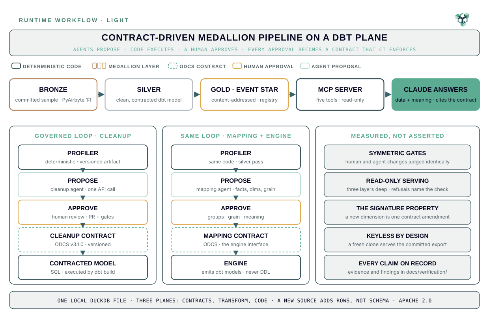
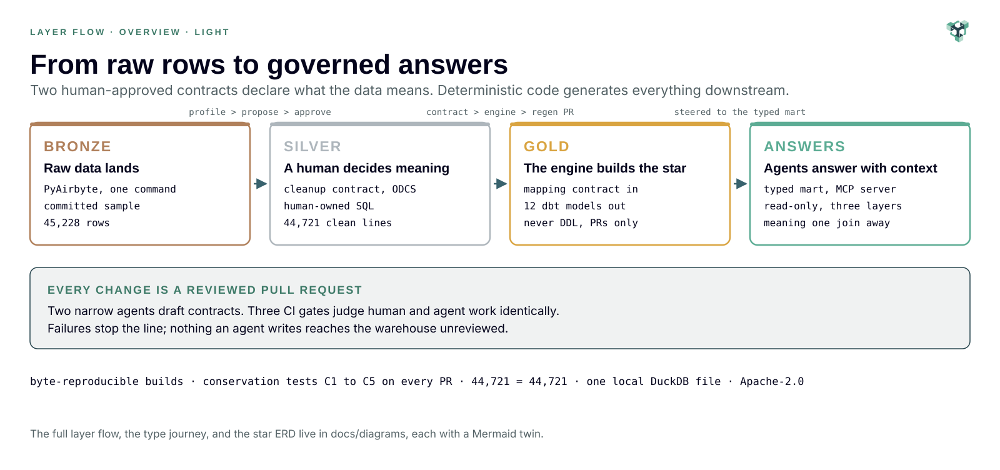
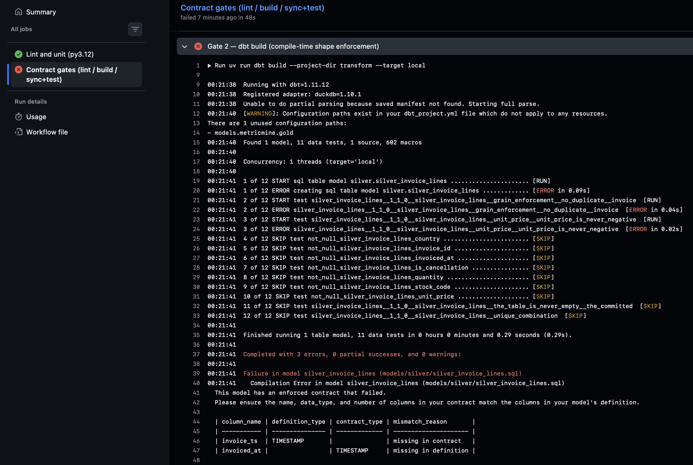
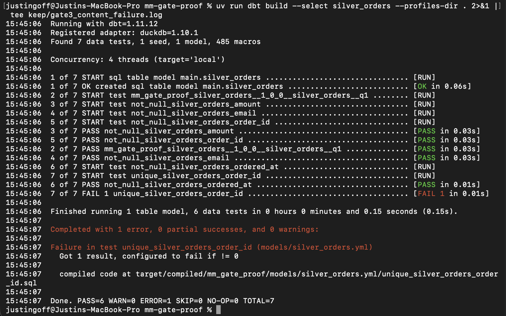

<div align="center">
  <picture>
    <source media="(prefers-color-scheme: dark)" srcset="docs/assets/mm_logo_on_dark.png">
    
  </picture>

  <p><strong>A contract-driven data pipeline that ends in an answer, not a table.</strong><br>
  Apache-2.0 &nbsp;·&nbsp; Python 3.12 &nbsp;·&nbsp; dbt + DuckDB &nbsp;·&nbsp; ODCS v3.1.0 &nbsp;·&nbsp; MCP</p>
</div>

## Agents propose. Humans approve. Deterministic code executes.

Every design judgment in this pipeline is a versioned, machine-readable
contract that a person approved by merging a pull request. Two narrow AI
agents draft contracts; deterministic code and dbt execute them; a
three-gate CI enforces them from then on. The agents hold no warehouse
credentials and never write: they read committed, hashed artifacts and
return a draft, and every approved contract records in git who proposed
it, a person or an agent with its model and profile hash, and which
person merged it. Nothing an agent produces reaches the warehouse
unreviewed, and the reasoning is in the repository: every
binding decision in the
[decision register](docs/decisions/decision-register.md), every measured
finding in the [findings register](docs/verification/gate_proof_findings.md),
and the [evidence](docs/verification/evidence/) each one cites. Contracts
are also how an AI assistant gets compact, reliable truth at serving time:
the gold layer carries a context registry one join from any payload.

<div align="center">
<a href="docs/diagrams/runtime_workflow_diagram_light.svg">
<picture>
<source media="(prefers-color-scheme: dark)" srcset="docs/diagrams/runtime_workflow_diagram_dark.svg">

</picture>
</a>
</div>

<div align="center"><sub>Detailed component diagrams, each with a
machine-readable Mermaid twin: <a href="docs/diagrams/">docs/diagrams/</a></sub></div>

## What this is

MetricMine is a contract-driven medallion pipeline that runs end to end on
one machine. Raw data lands in bronze; a deterministic profiler describes
it; machine-readable ODCS contracts, hand-written or proposed by two
narrow AI agents, shape silver and gold behind a human approval
gate; and an auto-modeling engine emits the entire gold layer from the
approved contract. The result is a governed dimensional gold layer with a
context registry one join from any payload, served read-only over MCP, so
an AI assistant answers business questions grounded in both the data and
the meaning behind it.

The repository is a deliberate work in progress: it advances in phases that
each exit in a working, demonstrable state. What exists runs, what is ahead
is stated plainly, and the docs folder carries every decision and
specification that got it here. The unified event star at the gold layer is
the experimental centerpiece; the practices around it are industry-standard
end to end.

## What the human owns, and what the machine owns

The human decides what the data means and how sources reconcile. The
machine decides how that meaning is structured and served. Meaning is
declared in two places, the silver cleanup contract and the gold mapping
contract, and everything downstream of those two declarations is a
mechanical, byte-reproducible function of them: 12 of the 13 dbt models on
`main` are engine-emitted and never hand-written. The one exception is
silver, `silver_invoice_lines.sql`, which stays human-owned on purpose,
because silver is where meaning is decided. What the agent proposes for
silver is the contract, not the SQL.

That split is what the design buys. A wrong number has an address: it
traces to the silver logic or to the mapping declaration, never to a hand
edit somewhere in the DAG. Determinism means the same inputs emit
byte-identical model files, verified against a committed golden fixture, so
a change is reproducible, diffable, and reviewable; it does not mean the
models are right. Correctness comes from separate machinery: contracts
enforced at build time, five conservation tests in CI, and a grain check
that measures a declared grain rather than trusting it. The pipeline offers
traceability and conservation, not observability, and regeneration lands as
a pull request, never as an automatic update.

The gold layer is a generic content-addressed container by design, not an
automated star schema. Dimensional intent (the grain, the entity groups, the
time column, an aggregation per measure) lives in the mapping contract, and
the engine materializes it into a fixed shape whose keys are content hashes.
That choice has three measured trade-offs, each recorded where a reader
will look: at transaction grain the category dimension is one-to-one with
its fact by construction
([F-23](docs/verification/gate_proof_findings.md#f-23)); `fact_hash_id` is a
content address, not a row identifier, and the name invites the wrong query
([F-24](docs/verification/gate_proof_findings.md#f-24)); and every served
value is canonical lowercased text, stated at the serving surface rather
than changed
([Amendment M to D-18](docs/decisions/decision-register.md#d-18)). One
source and one fact category exist today. The star's physical schema is
fixed regardless of how many sources feed it, so a second source adds rows
and a schema key rather than a schema migration: demonstrated at one
source, designed for more.

<div align="center">
<a href="docs/diagrams/layer_flow_overview_light.svg">
<picture>
<source media="(prefers-color-scheme: dark)" srcset="docs/diagrams/layer_flow_overview_dark.svg">

</picture>
</a>
</div>

<div align="center"><sub>Click the image for full size. The detailed
current-state <a href="docs/diagrams/layer_flow_current_state_light.svg">layer
flow</a> (<a href="docs/diagrams/layer_flow_current_state_dark.svg">dark</a>)
keeps every measured count, and the star itself is drawn in the
<a href="docs/diagrams/star_erd_current_state_light.svg">current-state ERD</a>
(<a href="docs/diagrams/star_erd_current_state_dark.svg">dark</a>), each with a
Mermaid twin beside it.</sub></div>

## What this repository demonstrates

**Strategy you can audit.** Forty binding decisions in a versioned
[decision register](docs/decisions/decision-register.md); specifications
written before code; explicit non-goals; and no claim without a
reproducible command behind it. The plan is not a slide deck. It is a
governed artifact that survives contact with the build, and the repository
carries the whole decision trail.

**An AI-augmented SDLC with real governance.** I architect and plan with an
AI copilot; Claude Code implements through small, reviewed pull requests;
and a three-gate contract CI (lint, compile-time build, generated tests)
judges human and agent changes symmetrically.
[CLAUDE.md](CLAUDE.md) maps every decision, spec, and diagram into the
coding agent's context, so any engineer, human or AI, starts grounded in
project state, methodology, and the end-in-mind vision.

**Industry-standard architecture, end to end.** PyAirbyte ingestion, a dbt
medallion (bronze, silver, gold), ODCS v3.1.0 data contracts enforced from
ingestion through serving, a unified event star with a content-addressed
context registry, and MCP at the serving edge. The agent layer is designed
against GenAIOps practice across PromptOps, RAGOps, and AgentOps,
right-sized for the project and documented like everything else.

## See it run

The repository ships `demo/demo.duckdb`, a verified ~11 MB gold-only
export, so serving works from a fresh clone with no build step and no
credentials:

```bash
git clone https://github.com/metricminellc/metricmine.git && cd metricmine
uv sync
uv run python -c "from metricmine.query import GoldWarehouse; print(GoldWarehouse().list_fact_categories())"
```

The full walkthrough (wiring the MCP server into Claude Desktop, the
questions to ask, the complete keyless replay from raw data to a fresh
export, and troubleshooting) is **[docs/demo.md](docs/demo.md)**, about
ten minutes end to end. A recording of the demo is attached to the
[latest release](https://github.com/metricminellc/metricmine/releases/latest).

## Architecture at a glance

Three planes organize the repository: `contracts/` is the specification
(ODCS data contracts a human approves), `transform/` is the dbt execution
project, and `src/` is hand-written Python: the profiler, the
auto-modeling engine, the context compiler, the shared query module, and
the MCP server. Data moves bronze → silver → gold in one local DuckDB
file. Gold is terminal and machine-emitted: a content-addressed star whose
physical schema does not depend on the sources that feed it. Serving is
read-only three layers deep, through five MCP tools over one shared query
module. Designs: the
[gold layer spec](docs/spec/gold-unified-event-star.md), the
[serving spec](docs/spec/serving.md), and the
[agent layer spec](docs/spec/agent-layer.md).

## Local by design

The whole pipeline runs on one machine, on DuckDB, by design: no cluster,
no cloud account for the demo, no warehouse credential in an agent's
hands. What lives on the machine is a specification, not a silo. The
contracts and the compiled context are warehouse-agnostic files in git,
and every gold model is regenerated from them, so the data file is
disposable and the meaning is portable. dbt profiles carry the execution
plane; a second adapter is an experiment, not a promise. Two machines that
pull the same commit build the same gold: the emitted models are
byte-identical against a committed oracle, and the demo digest matched
across a Linux sandbox and a Mac. A team shares the specification through
git and reproduces the data locally; nobody shares a database, a
credential, or a cluster. What scale means here is measured, never
claimed: [docs/scale.md](docs/scale.md) carries the curve on two stated
environments and the paths that keep large inputs from hitting a hard
limit, each behind configuration.

## Proof, committed

The contract gates were broken deliberately, in both directions, and the
evidence is committed. A shape defect, a renamed column, fails at
compile time, before any DDL runs: proven live in
[break-demo PR #45](https://github.com/metricminellc/metricmine/pull/45),
opened against the real pipeline and closed unmerged by design, its red
check permanent. A content defect, data violating a declared rule,
builds, then fails as an error-severity contract test:





The signature property (D-17) is the payoff, demonstrated rather than
asserted: adding the reserved `country` dimension took one
mapping-contract amendment and one regeneration. No engine code changed,
no physical schema changed, no gold contract amendment: 23 emitted files
moved, one schema key appeared, and row conservation held to the digit
(44,721 in, 44,721 out). The full narrative, with the staleness-guard and
ownership-drift refusals captured live, is
[docs/verification/signature-test.md](docs/verification/signature-test.md).

One more property is documented rather than discovered: the star's hash
keys are content addresses, not row identifiers. The counting rules, and
the trade they record, live in the gold spec's *Reading the star* section
and in findings
[F-23](docs/verification/gate_proof_findings.md#f-23) and
[F-24](docs/verification/gate_proof_findings.md#f-24).

## Go deeper

| If you want | Read |
|---|---|
| The demo, step by step | [docs/demo.md](docs/demo.md) |
| Every architectural decision, versioned | [docs/decisions/decision-register.md](docs/decisions/decision-register.md) |
| The layer specs, ingestion through serving | [docs/spec/](docs/spec/) |
| The evidence: findings, the signature test, gate breaks | [docs/verification/](docs/verification/) |
| The diagrams, SVG with Mermaid twins | [docs/diagrams/](docs/diagrams/) |
| The guardrails the coding agent works under | [CLAUDE.md](CLAUDE.md) |
| How to contribute, and what a pull request needs | [CONTRIBUTING.md](CONTRIBUTING.md) |
| What changed since the last release | [CHANGELOG.md](CHANGELOG.md) |

## Status and roadmap

[v1.0.0](https://github.com/metricminellc/metricmine/releases/tag/v1.0.0)
(September 2, 2026) is the current tagged release and the start of the
stable line. v0.1.0 shipped Phases 0
through 5: the scaffold and pinned toolchain, bronze ingestion, the
profiler and contracted silver, the engine-emitted unified event star, and
the serving layer with the committed demo artifact. v0.2.0 added the agent
layer (the two proposers in governed stances, drafts landing only through
reviewed pull requests, the first agent-proposed contract amendment live),
the typed surface, the dbt 1.12 line, and the SDLC layer's working-tree
guard, contract-review Skill, and GitHub Action. v0.3.0 added the scale
posture: the incremental path one config flip away, the C5 field-level
reconciliation gate, batch-scoped gates with a full-table audit, and
[docs/scale.md](docs/scale.md) with the measured curves on two machines.
v1.0.0 closed the release arc: issue forms, the DCO check, the contracts
provenance gate, `make doctor`, the demo-artifact gate in CI, the
devcontainer, and the front door as it reads now. The live roadmap is the
[Issues tab](https://github.com/metricminellc/metricmine/issues); the
[changelog](CHANGELOG.md) records what landed in each release.

## Toolchain

dbt-core 1.12.x with the dbt-duckdb 1.11.x adapter runs the transforms.
datacontract-cli 1.0.12, installed as an isolated uv tool, executes the
contracts. DuckDB 1.4.3 is the local warehouse. PyAirbyte handles
ingestion. The MCP server runs on the official `mcp` SDK, pinned to the
1.x maintenance line (D-32 as amended; the register records why). The code
is Python 3.12, managed with uv. Every pin is a register entry; none of
them is `latest`. Supported platforms: macOS and Linux on Python 3.12.
CI proves the path on a clean ubuntu checkout, the Mac measurements in
[docs/scale.md](docs/scale.md) state their environment, and `make doctor`
checks a machine before the first build.

## Non-goals

Multi-tenancy, auth, billing, any UI beyond the optional read-only demo,
streaming, Redshift, orchestration platforms, autonomous multi-step
agents, more than one or two source types, petabyte or throughput claims,
and production SLAs.

## Contributing

Contributions are welcome under the conventions in
[CONTRIBUTING.md](CONTRIBUTING.md): small reviewed pull requests, contracts
never weakened to pass, and a sign-off on every commit. Everyone taking part
follows the [code of conduct](CODE_OF_CONDUCT.md); vulnerabilities go
through [SECURITY.md](SECURITY.md), never a public issue.

## License

Apache-2.0. See [LICENSE](LICENSE) and [NOTICE](NOTICE).

## Name and logo

The MetricMine name and the MetricMine logo are not covered by the
Apache-2.0 license. Forks and derivative works may not use them in a way
that suggests endorsement by, or affiliation with, this project.
