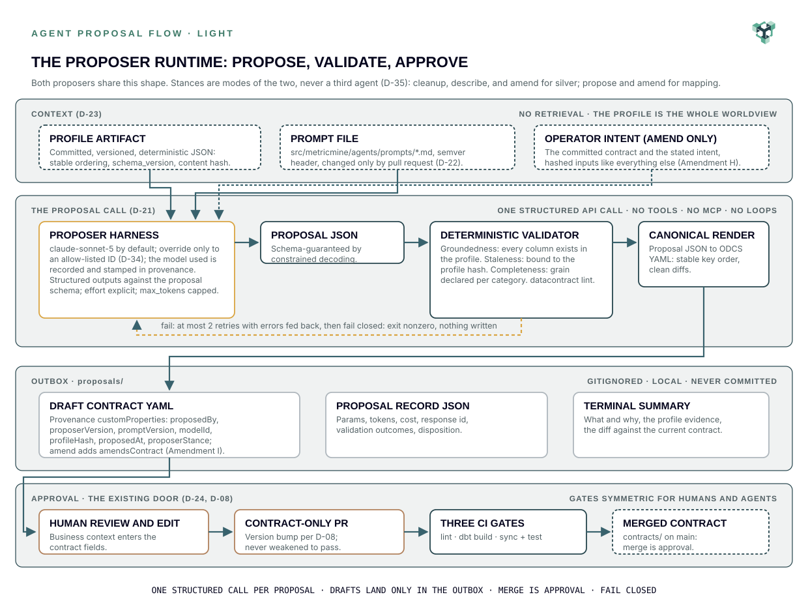

# The Agent Layer: Propose, Validate, Approve

**Status:** adopted design, July 12, 2026. Implements in Phase 6.
**Decisions:** D-21 through D-25, condensed in [the decision register](../decisions/decision-register.md).
**Diagram:** the published pair below ([light](../diagrams/agent_proposal_flow_light.svg) / [dark](../diagrams/agent_proposal_flow_dark.svg), [`.mmd` twin](../diagrams/agent_proposal_flow.mmd)).
**Source document:** Agent Layer Design 001 (July 12, 2026), of which this file is the in-repo transcription.

<div align="center">
<a href="../diagrams/agent_proposal_flow_light.svg">
<picture>
<source media="(prefers-color-scheme: dark)" srcset="../diagrams/agent_proposal_flow_dark.svg">

</picture>
</a>
</div>

The pipeline has exactly two agents (D-10): the **silver cleanup proposer** (bronze profile in, ODCS cleanup contract out) and the **gold mapping proposer** (silver profile in, ODCS mapping contract out). Neither touches data, writes code, nor runs transformations. Agents propose, code executes, a human approves. This document fixes how the two proposers are built, governed, and used.

## 1. Invocation architecture (D-21)

Each proposer is **one structured call** to the Anthropic Messages API through the official Python SDK (`anthropic>=1.0,<1.1`, resolved 1.0.0, a normal locked dependency from the Phase 6 harness PR onward; upgrades are deliberate, by pull request; D-21 Amendment F).

- **Model:** `claude-sonnet-5` by default. Model IDs of this generation are fixed snapshots, so the string is the pin. Never `latest`. An operator may swap the model for a run to an allow-listed ID (`claude-sonnet-5`, `claude-opus-5`, `claude-fable-5`) via `--model` or `MM_PROPOSER_MODEL`, in that precedence; an unlisted ID fails closed before any call; the model used is recorded and stamped in provenance (D-34).
- **Structured outputs:** the request sets `output_config.format` to the proposer's **proposal schema**, a structured-outputs-compatible projection of the contract shape kept at `docs/spec/agent-layer/gold-mapping-proposal.schema.json`, `docs/spec/agent-layer/silver-cleanup-proposal.schema.json`, and `docs/spec/agent-layer/table-contract-proposal.schema.json` (flat; every property required; every enum typed; variants flattened into a discriminator plus sibling arrays the validator holds consistent; the table-contract projection serves the `describe` and `amend` stances through its `stance` discriminator, D-35). Constrained decoding guarantees the response parses against it. The model cannot emit prose or a malformed proposal. The frozen mapping-contract schema is never sent to the API; it validates the rendered contract instead ([F-26](../verification/gate_proof_findings.md#f-26)). Each schema file is paired with an example proposal beside it.
- **Parameters:** effort set explicitly, `max_tokens` capped, all request parameters recorded per run.
- **Serialization boundary:** the model emits a structured proposal; deterministic glue renders canonical ODCS YAML with stable key order. Judgment proposes; code serializes.
- **Failure containment:** post-parse validation failures retry at most twice with errors fed back, then **fail closed**: exit nonzero, nothing written, raw response preserved for inspection. Retries apply only to errors the model can repair (schema, groundedness, completeness, lint); staleness and integrity failures fail closed at once without consuming the retry budget, and an SDK or transport error at the call fails closed at once with the error class and message in the record (Session N, S-N-1). Writes are atomic (temp file, rename). Loops are impossible by construction.
- **Least privilege:** the call carries no tools and no MCP connection. A proposer reads one profile artifact and writes only to the outbox. `ANTHROPIC_API_KEY` comes from the environment, never the repo. `make demo` requires no key.

The mid-pipeline agents do not use MCP. The MCP server exists at the serving layer (Phase 5) and is out of scope here.

## 2. Prompt governance and lineage (D-22)

- Prompts live at `src/metricmine/agents/prompts/`, one file per proposer, sharing a documented template anatomy, each with a **semver-and-changelog header** read at runtime.
- Prompt changes travel **only by pull request** under the standing commit conventions (D-14) and roll back by revert. Git is the prompt platform.
- Every proposed contract stamps provenance into ODCS `customProperties`: `proposedBy`, `proposerVersion`, `promptVersion`, `modelId`, `profileHash`, `proposedAt`. Hand-written contracts carry the same keys with `proposedBy: human` from the first Phase 3 contract onward, so the schema is uniform.
- The full request record (parameters, token counts, cost, response ID, validation outcomes, disposition) is a JSON sidecar in the gitignored outbox.
- **Injection posture:** profile sample values are untrusted because they derive from source data. Defense is layered: the prompt delimits the payload as data; structured outputs leave no free-text channel; the validator and `datacontract lint` gate the shape; a human reviews every contract; and the contract is declarative YAML never executed as code. The residual risk is a subtly wrong proposal, which the approval gate exists to catch.
- Exact prompt text is authored in Phase 6, after the spine has proven the contract shapes.

## 3. Grounding without retrieval (D-23)

The proposers use **no RAG**: no vector store, no embeddings, no similarity search. The versioned profile artifact is the sole context, injected complete into the call. Deterministic full-context injection is a stronger guarantee than retrieval at this scale, and that is the claim made.

**The profiler owes the agents** (discharged by [the profiler spec](profiler.md)):

- deterministic serialization with stable ordering,
- a `schema_version` field,
- a content hash over the canonical serialization,
- token-budget caps on sample values, distinct-value lists, and string lengths (versioned profiler constants),
- per-column name, inferred type, null rate, cardinality, samples; per-table row count and duplicate-row rate (grain evidence for the mapping proposer).

**The deterministic validator** gates every proposal before anything is written:

1. **Groundedness:** every column the proposal references must exist in the profile. The hallucinated-column rate is enforced to zero, not measured.
2. **Staleness:** the proposal is bound to the profile hash it consumed; if the profile has been regenerated since, validation fails.
3. **Completeness:** mapping proposals declare grain per category (aggregated or transaction); cleanup proposals must be lint-clean.
4. **Lint:** `datacontract lint` runs as the final step, the same check CI runs, so first-attempt lint pass is observable at propose time.

## 4. UX: the propose, review, approve flow (D-24)

The interaction surface is the CLI, the editor, and the pull request. Nothing else.

```
make propose-silver                    # bronze profile -> draft cleanup contract
make propose-silver SOURCE=b ORACLE=p  # one bronze table of the family, scored against its contract (D-41)
make propose-mapping                   # silver profile -> draft mapping contract
make propose-mapping TABLE=s ORACLE=p  # one unified silver table, scored against its mapping contract (D-41)
make propose-describe TABLE=t          # the table's own profile -> draft table contract (D-35)
make propose-amend TABLE=t INTENT="..."  # declared change set over the committed contract (D-35)
make verify-grain TABLE=t KEYS=a,b     # measure a declared grain, deterministic (F-10)
make enforce-properties TABLE=t        # the two enforcement keys sync omits (D-16 Amendment J)
make propose-queue MAX=n               # walk the derived queue, capped, one call per item (D-35)
```

1. **Propose.** The target selects the latest profile (or `--profile PATH`), runs the call, validates, and writes the draft contract, the validated proposal object (`proposal.json`), and its proposal record to `proposals/`, a **gitignored outbox**. Nothing under `contracts/` is touched. The terminal prints a rationale summary citing profile evidence, and, on regeneration (the draft carries the committed contract's id), a unified diff with both documents normalized through the same parse-and-dump path so comments and scalar styles never appear as changes; a first proposal for a new id starts its version line at 1.0.0 and prints no diff.
2. **Review.** Open the draft in the editor and edit freely; the draft is the reviewer's to change. Business context added during review lands in the contract fields the context compiler already harvests (D-19).
3. **Approve.** Copy the reviewed contract into `contracts/` on a branch with the version bump D-08 requires, and open the contract-only pull request. The three gates run. **Merge is approval.** Rejected drafts never leave the outbox.

4. **Adopt (the describe stance, D-35).** `make propose-describe TABLE=<model>` drafts the contract that would enforce an EXISTING silver table from that table's own profile artifact. It refuses when `contracts/<model>.odcs.yaml` already exists (the amend stance is the path for a contracted table); an explicit `ORACLE=<path>` bypasses the refusal for the recorded n=1 agreement study and writes `agreement.json` beside the record. The proposed grain is unverified until `make verify-grain TABLE=<model> KEYS=<a,b>` measures it against the warehouse (F-10). After the contract PR merges, `datacontract dbt sync` creates the properties file with exact types (F-27) and `make enforce-properties TABLE=<model>` adds only `contract.enforced` and the `not_null` constraints the contract implies (D-16 Amendment J); the file stays human-owned and the edit is reviewed in the model PR. The deterministic adoption tools live at `src/metricmine/adoption/`, never in the agents package: they are code, not agents (D-10 Amendment G).

5. **Amend (the amend stance, D-35).** `make propose-amend TABLE=<model> INTENT="<why>"` evolves a COMMITTED contract. Three governed inputs (D-23 Amendment H): the fresh profile, the committed contract (its raw bytes are the canonical bytes hashed into the `amendsContract` stamp, D-22 Amendment I; the staleness re-check hashes the same bytes), and the operator's intent, recorded verbatim in the proposal record. The model emits a declared `changes[]` set; deterministic code applies it as a patch over the committed document, so the draft's diff is the declared set by construction. The validator refuses false claims and undeclared moves symmetrically, derives the version bump from the change directions (patch for neutral, minor for widening, major for narrowing; the human sets the final version at approval), and refuses a narrowing set unless `ALLOW_RELAXATION=1` passes `--allow-relaxation`, which renders at a major bump with the printed rule-6 warning. Additions enter `required: false` with the tightening declared as a follow-up amendment after the model lands (F-28). Amend refuses an uncontracted table and points at describe, the mirror of describe's duplicate-id refusal.

6. **The family selectors (D-41).** The cleanup and propose stances run over one configured table by default (the retail sample). `SOURCE=<bronze table>` points the cleanup stance at `profiles/bronze.<source>/` with the target contract `contracts/silver_<source>.odcs.yaml`; `TABLE=<silver table>` points the propose stance at `profiles/silver.<table>/` with the target `contracts/gold_<category>_mapping.odcs.yaml`; `TARGET=<id>` overrides either default. The same proposer, the same stance, one structured call per run: a family of sources is a family of runs, never a batch inside one call. `ORACLE=<path>` scores the draft against a committed contract the same way describe does (below) and writes `agreement.json` beside the record.

`make demo` replays committed contracts and models, keyless and deterministic, unchanged. A regenerate path chains the propose targets live. Determinism belongs to replay; the human gate contains live variance.

## 5. Evaluation: the golden-profile set (D-25)

- **Fixtures:** the golden-profile set named in `config/default.yaml` under `agents.eval.fixtures`: the two committed Online Retail II profiles by reference (D-15), one constructed pathological profile under `tests/agents/fixtures/profiles/` built by the script beside it, the faker path when issue #15 lands, and since Arc 6 (D-41) the aviation family: six cleanup fixtures (one per bronze source, `source:` selecting it) and two mapping fixtures (`table:` selecting the unified silver table), each naming its `oracle:`, the committed human-authored contract. The recorded live proposals live under `tests/agents/fixtures/recorded/` for the render tests; a fixture whose recording has not landed skips those tests by name until the live run lands it.
- **Offline, every CI run, keyless:** the render path is tested against recorded proposals and the validator against constructed inputs, in the existing pytest lane.
- **Live, manual:** `make eval-agents` runs both proposers against the fixtures when a key is present and reports **first-attempt lint pass rate** and **first-attempt groundedness pass rate**, with token and cost actuals. It honors the D-34 model override, so a model comparison is one command; comparing is enabled, not performed.
- **The agreement study:** under an explicit `--oracle PATH` (or a fixture's `oracle:`) a stance scores its rendered draft against that committed contract on profile-evidenced elements only and writes `agreement.json` beside the record. For a table contract (describe, cleanup): per-column first-class fields, presence and order, the grain tuple, rule type shapes. For a mapping contract (propose): per-property mapping role and first-class fields, presence and order, the category header (entity group, source table, time column and grain, grain type), the role sets, and the degenerate identifiers as declared. Prose, decisions, and provenance never move the score. The eval report carries the study per fixture as agree/checked with the mismatch count. Reported as an n=1 study against self-authored ground truth, never as accuracy.
- **Deferred by intent:** LLM-as-judge scoring, automated A/B optimization, drift dashboards.

Phase 6 exits with fixtures committed, offline assertions green, and one recorded live run.

## 6. Cost posture

A bounding case (profile near the 30k-input-token cap, contract near 5k output tokens) prices under roughly twenty cents at standard rates; typical profiles run far smaller, so a routine regeneration stays under a dime. Token caps bound the worst case; tokens and computed cost land in every proposal record. Enforced budget infrastructure is deliberately not built at this scale.

## 7. What this layer never does

No third runtime agent; the generate-and-verify authoring loop stays in the SDLC layer as Claude Code pull requests (D-10). No autonomous multi-step agents (a standing non-goal, now backed structurally: one call, no loop, no tools). No MCP at proposer runtime. No writes to `contracts/`, `transform/`, or the warehouse. No API key in the replay path.

## Appendix A: Proposal record fields

`agent` (name, version) · `prompt_version` · `prompt_path` · `model_id` · `model_source` (`default` | `env` | `flag`) · `rates` (input_per_mtok, output_per_mtok) · `sdk_version` · `request_params` (effort, max_tokens) · `profile_path` · `profile_hash` · `profile_schema_version` · `created_at` · `response_id` · `stop_reason` · `usage` (input_tokens, output_tokens, summed over attempts) · `cost_usd_estimate` · `validation` (schema_pass, groundedness_pass, completeness_pass, staleness_pass, lint_pass, attempts, errors, attempt_log: one entry per attempt with the same pass flags and that attempt's errors) · `api_error` (class, message; null unless the call itself failed) · `disposition` (`draft_written` | `failed_closed`) · `draft_path` · `inputs` (the ordered governed inputs, each kind, path, content_hash, schema_version; Amendment H) · `intent` (the operator's intent verbatim; null outside the amend stance, Amendment I)

## Appendix B: Contract provenance keys (ODCS customProperties)

`proposedBy` (`human` | `silver-cleanup-proposer` | `gold-mapping-proposer`) · `proposerVersion` (absent for human: it versions the proposer harness, which does not exist for a human author) · `promptVersion` (absent for human) · `modelId` (absent for human) · `profileHash` (absent, with a
`provenanceNote` stating why, for hand-written contracts not derived from
a profile artifact, the pattern-derived gold star contract; never
fabricated) · `proposedAt`

## Appendix C: Layout delta (lands in Phase 6)

```
src/metricmine/agents/
├── __main__.py         # CLI: propose silver | propose mapping; --profile, --model
├── harness.py          # shared call: structured outputs, retry budget, record writing
├── models.py           # D-34: default model, allow-list with rate rows, resolver
├── agreement.py        # the first-class agreement metric (table and mapping contracts, --oracle)
├── validate.py         # groundedness, completeness, staleness, lint
├── render.py           # proposal JSON -> canonical ODCS YAML
├── propose_queue.py    # the batch driver: deterministic sequencing (D-35)
├── silver_proposer.py  # thin: schema + prompt binding
├── mapping_proposer.py # thin: schema + prompt binding
└── prompts/            # versioned prompt artifacts (semver front matter)
    ├── README.md       # template anatomy, versioning rules
    ├── silver_cleanup.md
    ├── silver_describe.md
    ├── silver_amend.md
    └── gold_mapping.md
docs/spec/agent-layer/  # proposal schemas (the API-facing projection) + examples
proposals/              # gitignored outbox: drafts + records
tests/agents/           # golden fixtures + offline assertions
```
